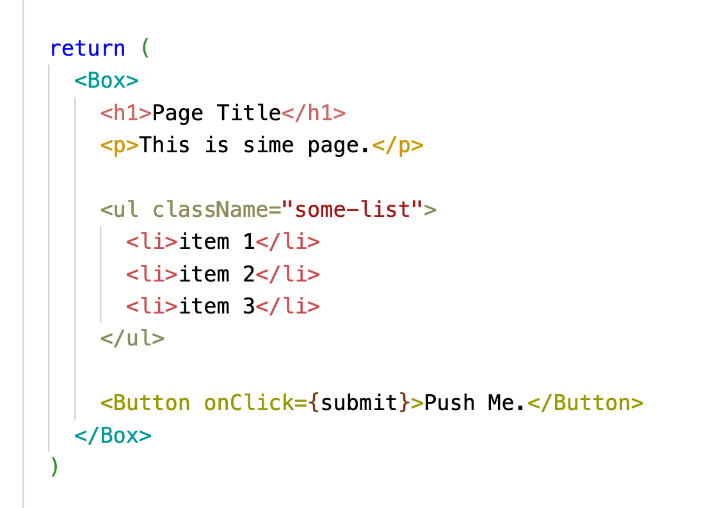

# Color the tag name
This extension will make your html tags colorful, just like my hair.  
Vue, React Components are also OK.
# タグに色つけ太郎
この拡張機能を使うと、HTMLのタグがカラフルになります。私の髪の毛のように。   
VueやReactのコンポーネントでもOKです。

## Now supports light themes!

